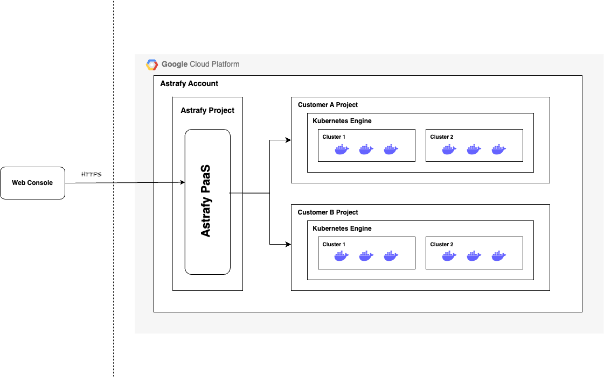
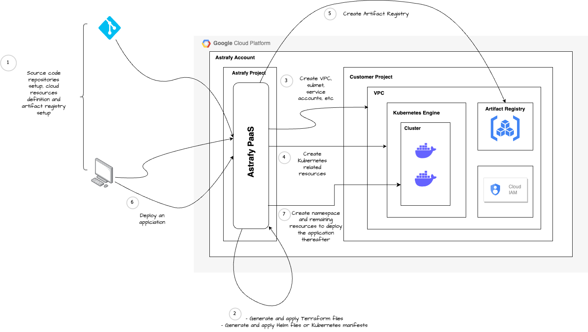

### Astrafy Platform as a Service

## Ease cloud resource provisioning and dockerised application deployment

# Overview of PaaS architecture

# Complete workflow PaaS architecture

# Brief explanation about the advantages of this design

As I've been working on GCP in my current job, I ended up considering the **GCP Projects** approach since it provides a seamless resource isolation, more specifically: users, APIs, billing, storage, authentication and monitoring settings. Thus, it's possible to reduce efforts at having customer insights centralised in one single place.

Another potential solution could've been the same but without the **GCP Projects** definitions, separating the customers only with VPCs which, I personally don't see it valuable comparing it with the mentioned above. The reason behind is that, it should be neccesary to spend more time on getting customer insights organised and centralised.